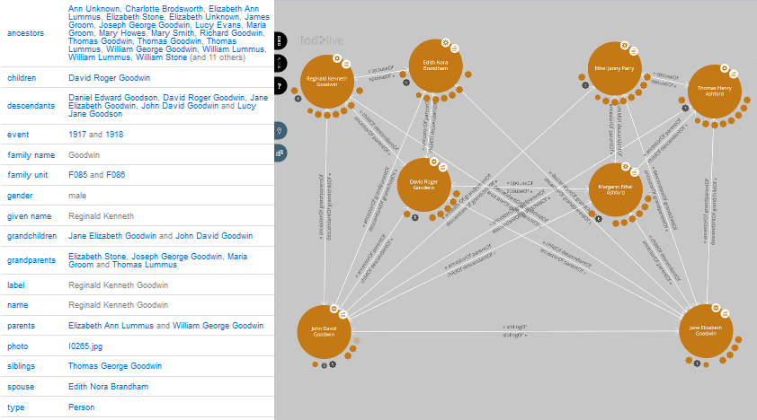

<h1>Modeling your data</h1>

When preparing your data for the semantic web, the first step is choose or create an ontology.
However, that is not the last choice to make.
The set of rules provided for the transform command is just one possible outcome of the proces.

# Ontologies or RDF schemas #

Some ontologies that surfaced from a quick survey:
  * [daml/gedcom](http://www.daml.org/2001/01/gedcom/gedcom) is simple but uses only a fraction of the information that can be stored in a gedcom. It has an apparently abandoned [variant](http://web.archive.org/web/20041214001231/http://orlando.drc.com/daml/Ontology/Genealogy/3.1/Gentology-ont.daml) More background on http://jay.askren.net/Projects/SemWeb/
  * [foaf](http://www.xml.com/pub/a/2004/02/04/foaf.html) together with [vocab/bio](http://purl.org/vocab/bio) seems to pretty much cover the core objects of a gedcom file.
  * [generations.owl](http://protege.cim3.net/file/pub/ontologies/generations/generations.owl) , [family.swrl.owl](http://protege.cim3.net/file/pub/ontologies/family.swrl.owl/family.swrl.owl) or [vocab/relationship](http://vocab.org/relationship/) for additional relations

# Indirect relations #

A resource describing a person in a family tree
will usually contain children, spouses and parents,
but maybe also siblings, grandparents and grandchildren.
However, these indirect relations produce a mess when shown in a graph,
even with just three generations.

The original text
[page](http://gothwin.data.seme4.com/id/person/I0265.html)
of the screenshots below, the full size
[graph](images/GoodwinFullSize.png)
and the interactive [graph](http://en.lodlive.it/?http://gothwin.data.seme4.com/id/person/I0243)

# Inverse relations #

When presenting your data with a SPARQL endpoint for querying,
you could decide to store the spouse relation with just one of both involved persons.
But when crawling the web (as for example with the LodLive graph),
it is usefull to have all indirect relations at hand.

# Ancestors and/or Descendants #

The person to person relation will produce a proper pedigree graph, but a graph that shows descendant shows crossing lines unless you omit spouses. Replacing the person to person relations by family nodes might even solve the crossing lines in a mixed graph, but makes the data less recognizable for foaf tools emerging from social media.