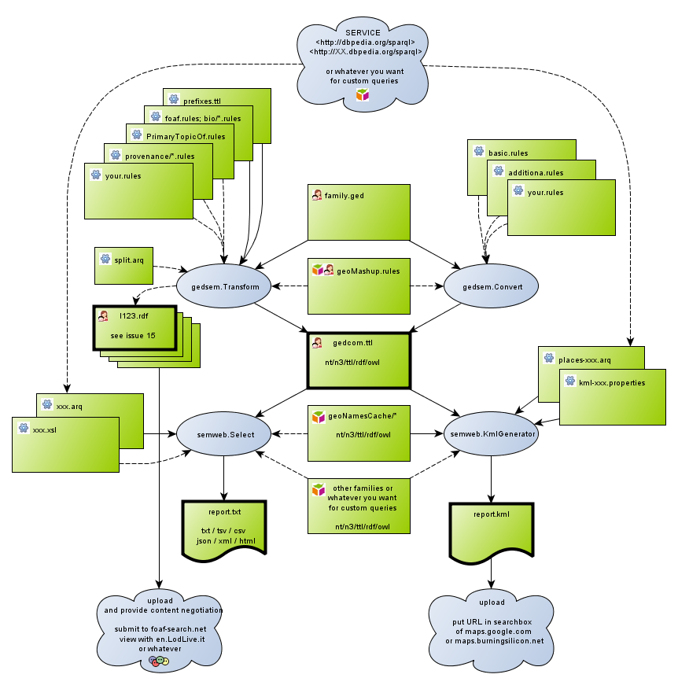
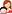

The library contains 2x2 main classes (oval symbols) that produce output (bold symbols). The diagram shows the files (green symbols) to specify as arguments. The main classes are executable from a command line, see legend for details.

[full size diagram](images/overview.png)

| symbol | meaning |
|-------|----------------------------------------------------------------------------|
| ovals | [commands](commands)  examples available in the root of the download |
| bold elements | output  should be the last argument |
|  | [configuration](Configuration)   examples available in the conf folder of the download.  To get the latest versions download raw files from the [resources](https://github.com/jo-pol/gedcom2sem/tree/master/src/test/resources) |
|  | your data  examples available in the test folder of the download.  To get the latest versions download raw files from the [test resources](https://github.com/jo-pol/gedcom2sem/tree/master/src/test/resources) |
|  | data from the [Semantic Web](SemanticWeb) |
|  | LOD data using foaf/bio/relation ontologies |
| - - - | optional |
