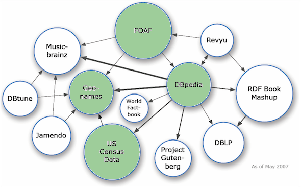
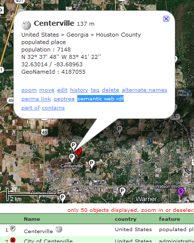

A toddler version of the
[LOD-cloud](http://lod-cloud.net/)
: "Linking Open Data cloud diagram, by Richard Cyganiak and Anja Jentzsch."
The fragment highlights some data that might be interesting for genealogy.

The datahub has a list of datsets tagged with [genealogy](http://datahub.io/tag/genealogy)

The following lists show resources you can cross-query directly together with your own data.

  * http://www.w3.org/wiki/SparqlEndpoints
  * http://labs.mondeca.com/sparqlEndpointsStatus/

Places and dates are some obvious entry points to relate your family tree with other data on the web.
`DbPedia` is not not only useful for places but can also be used as an almanac.

# `GeoNames` versus `DbPedia` #

`GeoNames` does not have a sparql endpoint,
therefore it has a different place in the diagram above than `DbPedia`.
`FactForge` includes both `GeoNames` and `DbPedia`,
but the merge causes trouble for the coordinates.
Multiple values appear for the latitude and longitude in different formats and precision,
no way to know their origin or even which belong together.
Sometimes even latitude and longitude are mixed up,
so in this case you are better off when you download the data.

# `GeoNames` downloads #

You may try to download the full
[rdf dump](http://download.geonames.org/all-geonames-rdf.zip)
if your unzip tool is powerful enough.

Another option is to download place by place.

You need to search for each place anyway to create
[geoMashup.rules](https://github.com/jo-pol/gedcom2sem/tree/master/src/test/resources/geoMashup.rules)
to map URI's with the place name literals in your gedcom.
The screenshot below shows the download link. The query
[mashup.arq](https://github.com/jo-pol/gedcom2sem/tree/master/src/test/resources/reports/mashup/mashup.arq)
helps to check completeness of geoMashup.rules.

