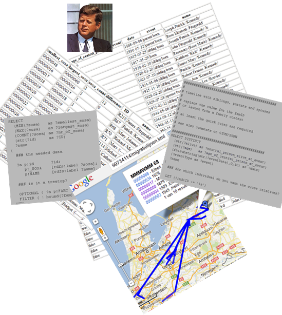

In the snapshots below, the map and reports on top are generated by this library.

In the center a preconfigured query for reports.

At the right bottom sits a toddler version of the [LOD-cloud](http://lod-cloud.net/):
The fragment highlights some interesting data to combine with your family tree,
a filtered list is available at the [datahub](http://datahub.io/tag/genealogy)

At the left bottom a short [LodLive](http://en.lodlive.it) demonstration.
It illustrates the possibility to traverse through different family trees
(and thus generate a single report) without merging GedCom files. 
Start with a French page on
[JFK](http://en.lodlive.it/?http://fr.dbpedia.org/resource/John_Fitzgerald_Kennedy),
follow the link to the same page in the English dbpedia (read: another family tree) 
and subsequently follow spouse and children.

Get started:
* prerequisites: _java_, for example from [AdoptOpenJDK](https://adoptopenjdk.net)
* download the last [gedcom2sem release](https://github.com/jo-pol/gedcom2sem/releases) and unzip
* on windows 
  * open a command prompt
  * `cd` into the unzipped directory
  * run `convert.bat` to create the file `kennedy.ttl`, it is needed by the next commands
  * `kml.bat` creates `kennedy.kml`, show it with a kml-viewer
  * `html-report.bat` creates `kennedy-age-diffs.html` which you can view with a browser
* Mac/*nix users need to fix a bug in the `*.sh` files:
  * delete `-SNAPSHOT` from `-cp gedcom2sem-0.2.3-SNAPSHOT.jar`
  * otherwise the same story as with the `*.bat` files on windows

Replace the `*.ged` file in these single line command files with your own file.
For the sake of the example `geoNamesCache.ttl` and `geoMashup.rules`
only contain the places for the JFK family tree.
For your own `kml` output you will have to [extend] both for your own family. 
Examine the developers overview, [BatchExamples] and 
other documentation in the sidebar links for further possibilities 
or [build from source](https://github.com/jo-pol/gedcom2sem).

[extend]: https://jo-pol.github.io/gedcom2sem/SemanticWeb#geonames-downloads
[BatchExamples]: https://github.com/jo-pol/gedcom2sem/blob/83711b81/src/test/java/gedcom2sem/BatchExamples.java
