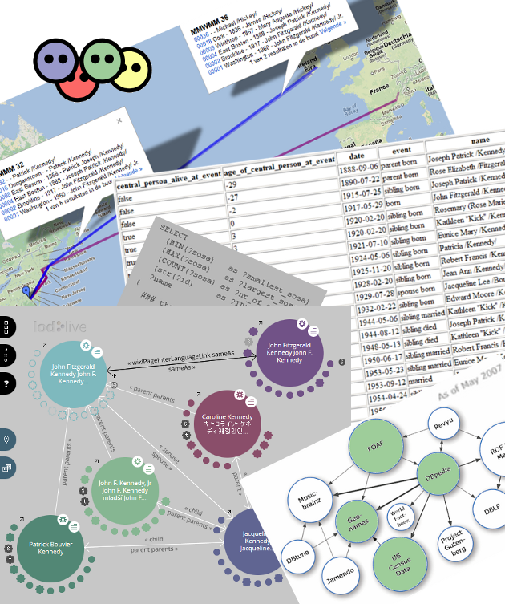

### Teaser

The table and map below are generated by the library.
At the right bottom sits a toddler version of the [LOD-cloud](http://lod-cloud.net/):
"_Linking Open Data cloud diagram, by Richard Cyganiak and Anja Jentzsch._" 
The fragment highlights some interesting data;
the actual list is provided by the [datahub](http://datahub.io/tag/genealogy)
The left bottom shows the result of a short [LodLive](http://en.lodlive.it)
demonstration: start with a French page on
[JFK](http://en.lodlive.it/?http://fr.dbpedia.org/resource/John_Fitzgerald_Kennedy),
follow the link to the same page in the English dbpedia (read: another family tree) and subsequently follow spouse and children.

